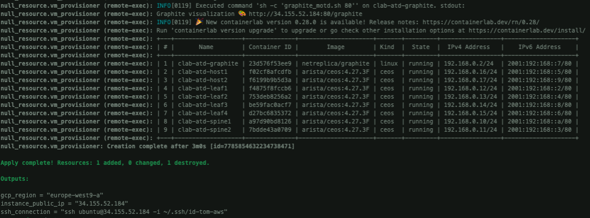

# VM Builder

Here you can find some materials to build VM in different cloud providers to run this demo by using your own cloud-provider as a lab-on-demand:

- [Google Cloud Platform](gcp/)
- [Amazon AWS](aws/)

It deploy a preconfigured VM with docker, python3 and containerlab.

Also, a remote-exec provisioner is configured to also install and launch content of this repository to make it available using https. It is all configured in a script named [`deploy.sh`](./deploy.sh) where you need to edit your arista.com API key

